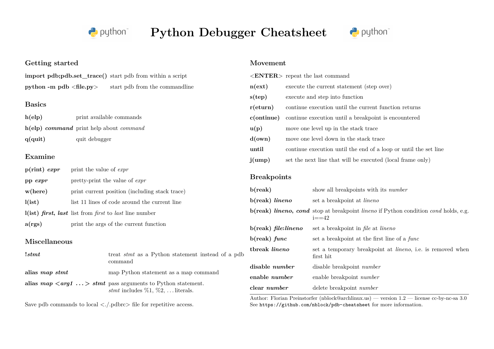
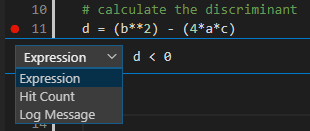
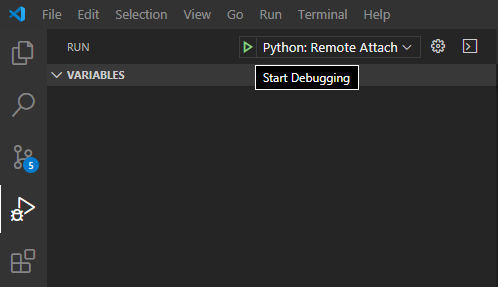

# What is a debugger?

A debugger helps to debug (what a surprise) a target program.

Common features include:
 - Set Breakpoints
 - Inspect variables
 - Modify value of variables
 - Inspect stack frames
 - Step into functions
 - Step line by line
 - Break on exception
 - Logpoints
 
Niche features (depends on language and environment)
 - Modify source code and continue running
 - Jump to line
 - Execute arbitrary code within current context (like REPL)
 - Reverse debugging
 - Navigate between threads
 - Custom data visualisations

# Why use a debugger?

No need to modify source code to add/remove temporary printlines.
Used well, it is much quicker than adding log statements and restarting
as you try to get closer to an issue.

By stepping through line-by-line, you will know *exactly* what your code is doing rather than guessing at what you think it is doing.

Even if you are not trying to fix a bug, but are writing new code, you should always use a debugger (once set up it's pretty easy).
Then, when you go to add a temporary print statement, just use a breakpoint instead.

Step into code from libraries.

# Debugging in Python
There are many different ways to use a debugger with python.
Because python is an interpreted language, it is often easy to attach a debugger anywhere you can get a console.

## PDB
Interactive debugger for CLI

https://docs.python.org/3/library/pdb.html

Can be triggered from code

```python
import pdb; pdb.set_trace()
```

or from terminal

```bash
python3 -m pdb helloworld.py
```

or post-mortem (eg. after running a function that crashed in the python terminal)

```python
>>> pdb.pm()
```

[Cheatsheet](https://github.com/nblock/pdb-cheatsheet/releases)


## Debugging with an IDE

Arguably the best debugging experience is with an IDE. You can see and navigate your code base like you normally would,
while being able to step through with the debugger and hover over variables to inspect values.

Add breakpoints by clicking in the gutter next to the line numbers.

Some IDEs support conditional breakpoints, allowing you to specify a condition for the breakpoint to hit.
This can be useful when there is a bug only for certain values, for example.
Logpoints can be used to log things to the debug console.



### Configuring your IDE for local debugging

If you are already launching your code from the IDE, it should be pretty simple to just launch it with debugger (eg. click "debug" instead of "run").

If you are running it locally from the console instead just because you want to provide arguments, check if you can configure the IDE to launch with those arguments.

If you can't launch it from the IDE for some reason but it is still running locally, you can attach to the running process by PID.

### Configuring you IDE for remote debugging over SSH

You can always just use pdb from the console. But, you can probably\* still attach your IDE!

\*If you have rights to make an ssh tunnel

The exact instructions will differ depending on your IDE,
but it will generally involve running your code on the
remote with a debug server
and attaching to it from the IDE.

#### Pycharm Professional

Pycharm has [some good documentation](https://www.jetbrains.com/help/pycharm/remote-debugging-with-product.html#remote-debug-config) on remote debugging.

#### VSCode

Run code (on remote machine), listening with `debugpy`:

```bash
pip install debugpy
python -m debugpy --listen 0.0.0.0:12345 --wait-for-client ./myscript.py
```

Install debugpy locally as well, and forward the port using ssh an ssh tunnel:

```bash
pip install debugpy
ssh -L 127.0.0.1:12345:127.0.0.1:12345 myRemoteServer
```

Install the [python extension](https://marketplace.visualstudio.com/items?itemName=ms-python.python) for VSCode

Add a launch configuration for VSCode

```json
{
    // ./.vscode/launch.json
    "version": "0.2.0",
    "configurations": [
        {
            "name": "Python: Remote Attach",
            "type": "python",
            "request": "attach",
            "port": 12345,
            "host": "localhost",
            "pathMappings": [
                {
                    "localRoot": "${workspaceFolder}",
                    "remoteRoot": "."
                }
            ],
        },
    ]
}
```

Run debugger using launch configuration.



#### Or, just use [VSCode Remote SSH](https://code.visualstudio.com/docs/remote/ssh)

The above options require having the same source code locally and remotely and keeping them in sync.

VSCode has the ability to run from a remote machine, allowing you to edit and debug code from the context of that remote machine.

#### Vim

If you're into Vim, you'll know what to do.

## Jupyter Notebook

Because of the nature of Jupyter Notebooks, you probably won't find the need to use a debugger very often (if at all).

If you need to though, you can always use pdb.
Some ipython kernals even have `%pdb` and `%debug` [magic](https://ipython.readthedocs.io/en/stable/interactive/magics.html#magic-pdb).
Sometimes pdb is a big buggy though due to the way some ipython kernals split up your code to run seperately line-by-line.

Apparently PyCharm Professional has a fully functional [Jupyter Notebook Debugger](https://www.jetbrains.com/help/pycharm/running-jupyter-notebook-cells.html#debug-notebook) - that's probably your best bet.